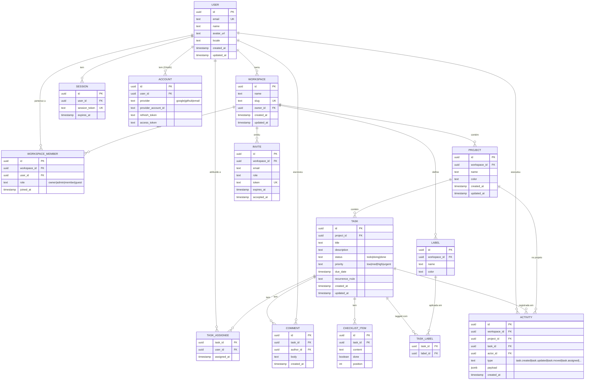

# Síntese Arquitetônica — app.tarefas

> **Sintetizado em:** 2026-07-10  
> **Inputs:** 3 relatórios de curadoria (`/workspace/curadoria/{frontend,backend,quality}/relatorio-*.md`) + estado atual do projeto em `/workspace/app-tarefas/todo-app/`.  
> **Versão:** 1.0 (proposta inicial para revisão).  
> **Idioma:** PT-BR (nomes de libs/ferramentas em inglês).

---

## Índice

1. [Sumário executivo](#1-sumário-executivo)
2. [Arquitetura completa com trade-offs](#2-arquitetura-completa-com-trade-offs)
3. [Estrutura de pastas](#3-estrutura-de-pastas)
4. [Roadmap em fases](#4-roadmap-em-fases)
5. [Backlog priorizado (MoSCoW)](#5-backlog-priorizado-moscow)
6. [Modelo de dados](#6-modelo-de-dados)
7. [Regras de negócio](#7-regras-de-negócio)
8. [API spec inicial](#8-api-spec-inicial)
9. [Estratégia de testes](#9-estratégia-de-testes)
10. [CI/CD no GitHub Actions](#10-cicd-no-github-actions)
11. [Métricas sugeridas](#11-métricas-sugeridas)
12. [Riscos técnicos e mitigação](#12-riscos-técnicos-e-mitigação)
13. [Primeiros 8-10 issues para GitHub](#13-primeiros-8-10-issues-para-github)
14. [Anexo: Checklist de implementação por sprint](#14-anexo-checklist-de-implementação-por-sprint)

---

## 1. Sumário executivo

**Tese:** construir um app Kanban moderno, multi-tenant, type-safe end-to-end, com deploy contínuo, em **2 semanas para MVP** e **6 semanas para V1**. A stack combina produtividade de boilerplate (T3) com ownership de código (shadcn/ui copy-paste), sem lock-in de vendor em componentes críticos (Better Auth no seu DB).

**Decisão de stack — a "tríade vencedora":**

| Camada | Escolha | Por quê |
|---|---|---|
| **Framework** | **T3 Stack** (Next.js 15 App Router + tRPC + Tailwind v4) | Type-safety end-to-end, scaffold em 5 min, Next.js Vercel-friendly |
| **ORM + DB** | **Drizzle ORM + Neon Postgres** | SQL-first, 12 KB bundle, edge-native, type-safety instant, Neon tem branching por PR |
| **UI + DnD + Auth** | **shadcn/ui + dnd-kit + Better Auth** | A11y de fábrica (Radix), copy-paste owner do código, multi-tenant nativo, RBAC + 2FA |

**Apoio:** Vercel (deploy), Sentry (errors), Inngest (filas), Resend (e-mail), Vitest + Playwright + MSW (testes), Pino + OpenTelemetry (logs/tracing), release-please (versionamento).

**Resultado esperado:**
- MVP funcional em **2 semanas** (1 usuário, 1 workspace, 1 projeto, tarefas com status, multi-tenant estrutural, i18n pt-BR, observabilidade básica)
- V1 em **+4 semanas** (multi-workspace, projetos, etiquetas, recorrência, MFA, login social, observabilidade full)
- Custos previsíveis abaixo de **$50/mês** até 10k MAU

---

## 2. Arquitetura completa com trade-offs

### 2.1 Frontend

**Decisão:** Next.js 15 (App Router) + tRPC + Tailwind v4 + shadcn/ui + dnd-kit

| Escolha | Trade-off (prós / contras) |
|---|---|
| **Next.js (App Router)** em vez de SPA pura (Vite/React) | ✅ SSR/SSG, edge functions, ISR, file-based routing, RSC reduz JS no cliente. ❌ Acopla ao Next; vendor-friendly Vercel. |
| **tRPC** em vez de REST | ✅ Type-safety end-to-end sem geração de client; refactors seguros. ❌ Lock-in tRPC (mas é só TS, fácil migrar). |
| **shadcn/ui** em vez de Mantine/MUI | ✅ Você é dono do código (copy-paste), Radix A11y WCAG, RSC-friendly. ❌ Sem components ultra-complexos prontos. |
| **dnd-kit** em vez de Pragmatic DnD | ✅ A11y nativa, virtualização, ecosystem, 12 KB, mais exemplos. ❌ Reescrita modular em alpha (pode quebrar minor). |
| **TanStack Query** (vem com T3) | ✅ Cache, optimistic updates, devtools. ❌ Bundle (~13 KB) — mas trivial. |
| **next-intl** em vez de i18next/react-i18next | ✅ Server-side i18n (App Router), TS-first, ICU MessageFormat. ❌ Menos plugins. |

**Roteamento:** file-based via Next.js App Router. Estrutura: `app/[locale]/(auth)/login`, `app/[locale]/(app)/[workspace]/projects/[project]`, etc.

**State management:**
- Server state: tRPC + TanStack Query (cache, refetch, optimistic)
- Client state: React `useState` + `useReducer` (Kanban UI)
- Form state: React Hook Form + Zod (vem com T3)

**i18n:** `next-intl` com locale `pt-BR` default + base para `en`, `es`. Strings em `messages/pt-BR.json` carregados server-side.

### 2.2 Backend

**Decisão:** API via **tRPC** (interno, fullstack TS) + **Inngest** (background jobs) + **Better Auth** (sessão/cookies)

| Escolha | Trade-off |
|---|---|
| **tRPC** em vez de REST | ✅ Type-safety end-to-end, sem geração de client. ❌ Não-consumível por apps mobile (no V2, exposto REST via tRPC adapter). |
| **Better Auth** em vez de Auth.js/Clerk | ✅ Multi-tenant nativo, RBAC + 2FA + passkeys built-in, sem lock-in, dados no seu DB. ❌ Projeto mais novo; SSO enterprise via plugin da comunidade. |
| **Inngest** em vez de BullMQ | ✅ Sem Redis/worker, `step.sleep` nativo, ideal para Vercel. ❌ Vendor (mas self-hostable). |
| **Validação: Zod** (compartilhado FE+BE) | ✅ Single source of truth. ❌ Bundle client +10 KB (irrelevante). |
| **Tenancy: header `X-Workspace-Id` + middleware tRPC** | ✅ Toda procedure valida `workspaceId` no JWT/session e bate com o recurso. ❌ Risco de leak se middleware mal escrito (mitigação: testes e2e de tenant isolation). |

**API style (interno):** tRPC.  
**API style (público futuro, V2):** REST adapter do tRPC se precisar de mobile/3rd-party.

**Validação:** todo input via Zod. Schemas em `src/lib/schemas/`.

**Tenancy:** middleware `enforceWorkspaceAccess` que:
1. Extrai `workspaceId` do path ou do body
2. Valida que o user é membro do workspace
3. Injeta `ctx.workspace` no procedure
4. Falha com `FORBIDDEN` se não for membro

**Rate limit:** Upstash Ratelimit (sliding window, 100 req/min por user no V1).

### 2.3 Banco de Dados

**Decisão:** **Postgres no Neon** (serverless) + **Drizzle ORM** + **Drizzle Kit** para migrations

| Escolha | Trade-off |
|---|---|
| **Neon** em vez de Supabase | ✅ Branching por PR, autosuspend, free tier generoso, serverless puro. ❌ Sem Auth/Storage/RLS nativo. |
| **Drizzle** em vez de Prisma | ✅ SQL-first, 12 KB, type-safety instant, edge-native. ❌ Drizzle Studio menos polido. |
| **Drizzle Kit** para migrations | ✅ SQL versionado, reversível. ❌ Manual para casos complexos. |
| **UUID v7** (não v4) | ✅ Ordenável por tempo, melhor para paginação cursor e índices. |

**Pooling:** Neon tem pooler nativo. Em serverless, sempre usar `?pgbouncer=true&connect_timeout=15` na URL.

**Migrations workflow:**
1. Editar `src/server/db/schema.ts`
2. `pnpm drizzle-kit generate` → gera SQL em `drizzle/00XX_name.sql`
3. `pnpm drizzle-kit migrate` em dev/staging
4. CI roda `drizzle-kit migrate --dry-run` para validar
5. Production: `drizzle-kit migrate` via job GitHub Actions (manual approval)

### 2.4 Auth

**Decisão:** **Better Auth** com plugins `organization`, `two-factor`, `passkey`

- **Sessão:** cookie httpOnly + sameSite=lax, 30 dias, refresh em uso
- **JWT:** não usa — sessão fica no DB (permite revogação imediata)
- **Roles:** `owner` > `admin` > `member` > `guest` (4 níveis, definidos pelo plugin organization)
- **MFA:** TOTP + passkeys (WebAuthn) habilitados no V1
- **Social login:** Google + GitHub no V1; Apple + Microsoft no V2
- **Convite:** e-mail com link assinado (24h expira) via Resend
- **Reset de senha:** token de uso único, 1h expira

**RBAC enforcement:**
- Middleware `requireRole(role)` em procedures tRPC
- UI esconde ações que o user não pode fazer
- DB: `tasks.org_id` + `task_assignees.user_id` (junction)

### 2.5 Observabilidade

**Decisão:** **Pino** (logs JSON) + **OpenTelemetry → Sentry** (tracing/APM) + **Sentry** (errors) + **Vercel Analytics** (RUM frontend)

| Camada | Ferramenta | Como |
|---|---|---|
| **Logs estruturados** | Pino | JSON em stdout, redact de PII, child loggers por request |
| **Errors frontend** | Sentry | SDK Next.js, source maps, PII scrub |
| **Errors backend** | Sentry | SDK Node, scope por request, release tracking |
| **Tracing** | OpenTelemetry → Sentry | Auto-instrumentation, sample rate 10% |
| **RUM / Web Vitals** | Vercel Analytics + Sentry Performance | LCP, FID, CLS reais |
| **Uptime** | Sentry Cron (ou Better Stack free) | Pings a cada 5min no endpoint `/healthz` |

---

## 3. Estrutura de pastas

**Decisão:** **monorepo pnpm workspaces** (sem Turborepo no MVP, adiciona se virar grande).

Justificativa: app.tarefas é **um único deploy Next.js** (fullstack). Monorepo simples com `apps/web` + `packages/shared` é suficiente. Turborepo adiciona complexidade sem ganho até ter 3+ apps.

```text
app-tarefas/
├── apps/
│   └── web/                                # Next.js 15 (App Router)
│       ├── app/
│       │   └── [locale]/
│       │       ├── (auth)/
│       │       │   ├── login/page.tsx
│       │       │   ├── register/page.tsx
│       │       │   └── accept-invite/[token]/page.tsx
│       │       ├── (app)/
│       │       │   ├── layout.tsx          # Auth + i18n provider
│       │       │   ├── [workspace]/
│       │       │   │   ├── page.tsx        # Dashboard
│       │       │   │   ├── projects/
│       │       │   │   │   ├── page.tsx
│       │       │   │   │   └── [projectId]/
│       │       │   │   │       ├── page.tsx            # Kanban
│       │       │   │   │       └── tasks/[taskId]/page.tsx
│       │       │   │   └── settings/
│       │       │   └── settings/
│       │       └── layout.tsx              # Root layout
│       ├── components/
│       │   ├── ui/                         # shadcn/ui (copy-paste)
│       │   ├── kanban/                     # Board, Column, Card
│       │   ├── task/                       # TaskForm, TaskDetail, TaskComment
│       │   └── auth/                       # LoginForm, RegisterForm
│       ├── lib/
│       │   ├── auth.ts                     # Better Auth instance
│       │   ├── auth-client.ts              # Client helpers
│       │   ├── logger.ts                   # Pino
│       │   ├── inngest.ts                  # Inngest client
│       │   ├── i18n.ts                     # next-intl config
│       │   └── utils.ts
│       ├── styles/
│       │   └── globals.css                 # Tailwind v4
│       ├── public/
│       ├── e2e/                            # Playwright tests
│       ├── instrumentation.ts              # OTel + Sentry
│       ├── sentry.{client,server,edge}.config.ts
│       ├── next.config.ts
│       ├── tailwind.config.ts              # se necessário
│       ├── package.json
│       └── tsconfig.json
├── packages/
│   ├── shared/                             # Schemas Zod, tipos, constantes
│   │   ├── src/
│   │   │   ├── schemas/                    # task.ts, workspace.ts, user.ts
│   │   │   ├── types/
│   │   │   ├── enums/
│   │   │   └── constants/
│   │   └── package.json
│   ├── server-db/                          # Drizzle schema + client
│   │   ├── src/
│   │   │   ├── schema/                     # users, workspaces, projects, tasks...
│   │   │   ├── client.ts                   # db instance
│   │   │   └── seed.ts
│   │   ├── drizzle/                        # Migrations geradas
│   │   └── package.json
│   └── emails/                             # React Email templates
│       ├── src/
│       │   ├── TaskAssigned.tsx
│       │   ├── TaskOverdue.tsx
│       │   └── WorkspaceInvite.tsx
│       └── package.json
├── inngest/                                # Funções serverless
│   ├── functions/
│   │   ├── task-overdue-reminder.ts
│   │   ├── task-recurrence.ts
│   │   └── workspace-cleanup.ts
│   └── client.ts
├── pnpm-workspace.yaml
├── package.json
├── tsconfig.base.json
├── .github/
│   ├── workflows/
│   │   ├── ci.yml
│   │   ├── deploy-preview.yml
│   │   ├── deploy-production.yml
│   │   └── release-please.yml
│   ├── CODEOWNERS
│   └── PULL_REQUEST_TEMPLATE.md
├── docker-compose.yml                      # Postgres local (dev) + Mailhog
├── .env.example
├── .editorconfig
├── .prettierrc.json
├── eslint.config.js
├── README.md
└── LICENSE
```

**Por que packages separados:**
- `shared/`: tipos Zod compartilhados entre FE/BE (single source of truth)
- `server-db/`: schema Drizzle isolado, reutilizável em testes/Testcontainers
- `emails/`: React Email isolado, deployável em Vercel como package separado
- `inngest/`: funções isoladas, fácil de testar com mocks

---

## 4. Roadmap em fases

### MVP (2 semanas) — "Pode usar"

**Épicos:**
1. Fundação: scaffold T3, Tailwind, shadcn/ui, ESLint, Prettier, GitHub Actions
2. DB + Auth: Drizzle schema, migrations, Better Auth (e-mail/senha), organizations plugin
3. Core Kanban: workspace, projeto, tarefa (CRUD + status move), comentários básicos
4. UI Kanban: shadcn/ui, dnd-kit, página de board, modal de tarefa
5. i18n pt-BR: next-intl, tradução de todas as strings
6. Observabilidade mínima: Pino logs, Sentry errors, Vercel Analytics
7. CI/CD: lint+typecheck+test+build no PR, deploy preview, deploy prod na main

**Critério de "pronto pra lançar":**
- 1 usuário consegue: registrar, confirmar e-mail, criar workspace, criar projeto, criar tarefa, mover entre status, marcar concluída, sem bugs bloqueantes
- 0 erros críticos em Sentry nas últimas 24h de staging
- LCP < 2.5s no board (medido em staging com Vercel Analytics)
- CI verde (lint+typecheck+test+e2e)
- Logs estruturados visíveis no Sentry
- Rate limit básico ativo
- 5 fluxos E2E passando (Playwright)

### V1 (semanas 3-8, +4 semanas) — "Pode vender"

**Épicos:**
1. **Multi-workspace UI:** switcher no header, dashboards por workspace
2. **Convites:** enviar por e-mail, aceitar, role-based access
3. **Login social:** Google, GitHub
4. **MFA + Passkeys:** TOTP, WebAuthn
5. **Etiquetas (labels):** CRUD, filtro por etiqueta, color picker
6. **Vencimento:** data, notificações por e-mail (Inngest + Resend)
7. **Recorrência:** RRULE básico (daily/weekly/monthly), próxima ocorrência automática
8. **Busca:** full-text em título/descrição (Postgres tsvector)
9. **Filtros avançados:** status, prioridade, responsável, etiqueta, vencimento
10. **Atividade (audit log):** evento de cada mudança, timeline visual
11. **Checklists (subtasks):** dentro de tarefa
12. **Métricas:** RUM completo, dashboards Sentry
13. **Testes:** cobertura >70% unit, 8 fluxos E2E
14. **Dark mode:** next-themes

**Critério "V1 pronto":**
- 10k MAU suportados sem degradação (load test k6)
- 0 vazamentos de tenant em testes
- LGPD: dados de usuário deletáveis via "delete account" (cascade)
- 99.9% uptime medido
- MTTR < 30min (alertas Sentry → fix → release)

### V2 (pós-mês 2) — "Pode expandir"

**Ideias:**
- Real-time updates (Server-Sent Events ou Supabase Realtime)
- App mobile (React Native, ou wrapper Tauri/Capacitor)
- Integrações: Slack, Google Calendar, Notion
- Automações (rules engine: "se tarefa vence, mover para Doing")
- IA: priorização automática, sugestão de próxima tarefa
- Tempo estimado por tarefa (tracking + relatórios)
- Subtasks hierárquicas (parent/child)
- White-label para B2B
- API pública REST (tRPC → REST adapter)
- Webhooks de saída

---

## 5. Backlog priorizado (MoSCoW)

### Must (MVP — 2 semanas)

| # | Título | Descrição | Critério de aceite |
|---|--------|-----------|---------------------|
| M1 | Scaffold T3 com Better Auth | Rodar `create-t3-app`; substituir NextAuth por Better Auth; validar login e-mail/senha | Login com e-mail/senha funciona end-to-end; sessão persiste em cookie; user no Postgres |
| M2 | Schema Drizzle inicial (User, Workspace, Project, Task) | Modelar 4 tabelas com FKs; gerar migrations; seed dev | `drizzle-kit generate` produz SQL; `drizzle-kit migrate` aplica; dados seed aparecem |
| M3 | tRPC: procedures de workspace (create, get, list) | Procedures `workspace.create`, `workspace.get`, `workspace.list` com auth + Zod | User autenticado consegue criar workspace; workspace é listado na home; 401 se sem auth |
| M4 | tRPC: procedures de projeto (create, get, list) | Procedures `project.create`, `project.get`, `project.list` com auth + workspaceId | Project é criado dentro do workspace; falha com 403 se user não é membro |
| M5 | tRPC: procedures de tarefa (create, get, list, update status) | CRUD básico + `task.moveStatus(id, status)` | Tarefa é criada; status é alterável; histórico de status é logado |
| M6 | UI: Board Kanban (shadcn/ui + dnd-kit) | Página `/[workspace]/projects/[projectId]` com 3 colunas (todo/doing/done); dnd-kit funcional | Drag-and-drop entre colunas funciona; persistência no backend; A11y keyboard OK |
| M7 | UI: Modal de criação/edição de tarefa | shadcn Dialog com form (título, descrição, status, prioridade) | Tarefa é criada/editada via modal; validação client+server (Zod) |
| M8 | i18n pt-BR com next-intl | Configurar next-intl; traduzir todas as strings; default pt-BR | Todas as páginas renderizam em pt-BR; troca de locale (en) funciona |
| M9 | Observabilidade: Pino + Sentry | Logger Pino; Sentry SDK no client+server; source maps | Logs em JSON no stdout; erros viram issues no Sentry; release tracking ativo |
| M10 | CI: lint + typecheck + test + build | GitHub Actions roda em todo PR; falha se qualquer um quebrar | PR com erro de lint/typecheck/test não pode mergear |
| M11 | Deploy: Vercel + Neon + env vars | Configurar projeto Vercel; conectar Neon; secrets | Push na main faz deploy em prod; PR abre preview deploy |
| M12 | Rate limit básico | Upstash Ratelimit (free tier) em rotas de auth | 100 req/min/user; retorna 429 com header `Retry-After` |

### Should (V1 — +4 semanas)

| # | Título | Descrição | Critério de aceite |
|---|--------|-----------|---------------------|
| S1 | Convite de membros por e-mail | Owner convida por e-mail; link assinado 24h; user aceita e entra no workspace | Convite é enviado via Resend; link funciona; novo user tem role correto |
| S2 | RBAC completo (4 roles) | Owner/Admin/Member/Guest com permissões granulares; UI esconde ações não permitidas | Middleware `requireRole` bloqueia ações; testes cobrem 4 roles |
| S3 | Login social (Google + GitHub) | OAuth providers via Better Auth; fluxo de callback | Login com Google funciona; user existente é linkado; novo user é criado |
| S4 | MFA TOTP | Habilitar 2FA no profile; QR code; recovery codes | TOTP funciona; recovery codes são gerados e válidos; sem TOTP não acessa |
| S5 | Passkeys (WebAuthn) | Login com biometria/segurança de hardware | Chrome/Safari registram passkey; login com passkey funciona |
| S6 | Etiquetas (labels) | CRUD de etiqueta por workspace; atribuir a tarefa; filtrar | Etiqueta tem cor; múltiplas por tarefa; filtro funciona |
| S7 | Vencimento + notificação por e-mail | Data de vencimento; Inngest agenda e-mail X horas antes | Notificação é enviada; e-mail chega no horário; task fica "vencida" visualmente |
| S8 | Recorrência (RRULE) | Tarefa recorrente (daily/weekly/monthly); cria próxima automaticamente | RRULE gera próxima tarefa; funciona em 3 frequências |
| S9 | Busca full-text | Postgres tsvector em título+descrição; barra de busca | Busca retorna resultados relevantes em <500ms |
| S10 | Filtros avançados no board | Filtro por status, prioridade, responsável, etiqueta, vencimento | 5 dimensões de filtro combináveis; query string reflete estado |
| S11 | Atividade (audit log) | Cada mudança (created/updated/deleted/moved/assigned) gera evento imutável | Timeline na task mostra últimas 50 ações; exportável |
| S12 | Checklists (subtasks) | Itens de checklist dentro de tarefa; marcar done | Checklist é ordenável; progresso % aparece na card |
| S13 | Dark mode | next-themes; toggle no header; persistência | Dark mode funciona; preferência é salva no localStorage |
| S14 | E2E completo (8 fluxos) | Playwright cobre auth, kanban, invite, MFA, recurrence | 8 specs passando em CI em <5min |
| S15 | Load test (k6) | Smoke test 100 RPS por 30s em prod (sintético) | p95 < 500ms TTFB; 0 erros 5xx |

### Could (V2 — após V1)

| # | Título | Descrição | Critério de aceite |
|---|--------|-----------|---------------------|
| C1 | Real-time updates | SSE ou WebSocket; 2 usuários veem mudança < 500ms | Mover tarefa aparece em outra sessão em <1s |
| C2 | Integração Slack | Notificar canal quando tarefa é criada/atribuída | Webhook Slack funciona; configuração por workspace |
| C3 | Integração Google Calendar | Tarefa com vencimento vira evento | OAuth Google Calendar; sync bidirecional |
| C4 | App mobile (Tauri ou Capacitor) | Wrapper da web; push notifications | App roda iOS+Android; push quando atribuído |
| C5 | Automações (rules engine) | User define "se X, então Y" (sem código) | UI para criar rule; rule é executada via Inngest |
| C6 | IA: priorização automática | LLM sugere prioridade baseado em texto | Sugestão aparece no modal; user aceita ou ignora |
| C7 | Tracking de tempo | Start/stop timer na tarefa; relatório | Tempo é gravado; relatório por usuário/projeto/semana |
| C8 | Subtasks hierárquicas | Tarefa dentro de tarefa (tree) | Estrutura tree renderiza; drag entre níveis |
| C9 | White-label (B2B) | Custom logo, cores, domínio por tenant | Tenant configura branding; aplica em e-mails e UI |
| C10 | API pública REST | Adapter tRPC → REST para integrações 3rd-party | OpenAPI spec gerado; auth via API key |

### Won't (agora, com justificativa)

| # | Item | Por que não |
|---|------|-------------|
| W1 | Trello/Asana import | Demanda de migração é baixa no MVP; users geralmente começam do zero. Reavalia no V2. |
| W2 | Custom fields por workspace | Complexidade alta (schema dinâmico), valor incerto. Considerar no V2 com "labels + valores". |
| W3 | Dependências entre tarefas (blockers) | Adiciona acoplamento forte entre itens. Valor marginal para 1-10 users. |
| W4 | Gantt chart / timeline view | Foco é Kanban; Gantt é outro produto. Não para V1/V2. |
| W5 | Comentários rich-text (Tiptap/ProseMirror) | Editor markdown simples no V1; rich text só se virar feature crítica de mercado. |

---

## 6. Modelo de dados

### 6.1 Diagrama ER (Mermaid)



### 6.2 DDL resumido (Postgres via Drizzle)

```ts
// packages/server-db/src/schema/users.ts
import { pgTable, uuid, text, timestamp } from "drizzle-orm/pg-core";
export const users = pgTable("users", {
  id: uuid("id").primaryKey().defaultRandom(),
  email: text("email").notNull().unique(),
  name: text("name").notNull(),
  avatarUrl: text("avatar_url"),
  locale: text("locale").notNull().default("pt-BR"),
  createdAt: timestamp("created_at").notNull().defaultNow(),
  updatedAt: timestamp("updated_at").notNull().defaultNow(),
});

// packages/server-db/src/schema/workspaces.ts
import { pgEnum } from "drizzle-orm/pg-core";
export const roleEnum = pgEnum("role", ["owner", "admin", "member", "guest"]);
export const workspaces = pgTable("workspaces", {
  id: uuid("id").primaryKey().defaultRandom(),
  name: text("name").notNull(),
  slug: text("slug").notNull().unique(),
  ownerId: uuid("owner_id").notNull().references(() => users.id, { onDelete: "restrict" }),
  createdAt: timestamp("created_at").notNull().defaultNow(),
  updatedAt: timestamp("updated_at").notNull().defaultNow(),
});
export const workspaceMembers = pgTable("workspace_members", {
  id: uuid("id").primaryKey().defaultRandom(),
  workspaceId: uuid("workspace_id").notNull().references(() => workspaces.id, { onDelete: "cascade" }),
  userId: uuid("user_id").notNull().references(() => users.id, { onDelete: "cascade" }),
  role: roleEnum("role").notNull().default("member"),
  joinedAt: timestamp("joined_at").notNull().defaultNow(),
}, (t) => ({
  uniqueMember: uniqueIndex("workspace_member_unique").on(t.workspaceId, t.userId),
}));

// packages/server-db/src/schema/tasks.ts
export const statusEnum = pgEnum("status", ["todo", "doing", "done"]);
export const priorityEnum = pgEnum("priority", ["low", "med", "high", "urgent"]);
export const projects = pgTable("projects", {
  id: uuid("id").primaryKey().defaultRandom(),
  workspaceId: uuid("workspace_id").notNull().references(() => workspaces.id, { onDelete: "cascade" }),
  name: text("name").notNull(),
  color: text("color").notNull().default("#3b82f6"),
  createdAt: timestamp("created_at").notNull().defaultNow(),
  updatedAt: timestamp("updated_at").notNull().defaultNow(),
});
export const tasks = pgTable("tasks", {
  id: uuid("id").primaryKey().defaultRandom(),
  projectId: uuid("project_id").notNull().references(() => projects.id, { onDelete: "cascade" }),
  title: text("title").notNull(),
  description: text("description"),
  status: statusEnum("status").notNull().default("todo"),
  priority: priorityEnum("priority").notNull().default("med"),
  dueDate: timestamp("due_date"),
  recurrenceRrule: text("recurrence_rrule"),
  position: integer("position").notNull().default(0), // order within column
  searchVector: customType<...>, // tsvector for full-text
  createdAt: timestamp("created_at").notNull().defaultNow(),
  updatedAt: timestamp("updated_at").notNull().defaultNow(),
}, (t) => ({
  projectIdx: index("task_project_idx").on(t.projectId),
  statusIdx: index("task_status_idx").on(t.projectId, t.status, t.position),
  dueIdx: index("task_due_idx").on(t.dueDate),
  searchIdx: index("task_search_idx").using("gin", t.searchVector),
}));
export const taskAssignees = pgTable("task_assignees", {
  taskId: uuid("task_id").notNull().references(() => tasks.id, { onDelete: "cascade" }),
  userId: uuid("user_id").notNull().references(() => users.id, { onDelete: "cascade" }),
  assignedAt: timestamp("assigned_at").notNull().defaultNow(),
}, (t) => ({
  pk: primaryKey({ columns: [t.taskId, t.userId] }),
}));

// ... comments, checklist_items, labels, task_labels, activities, invites, sessions, accounts
```

**Índices críticos:**
- `tasks(project_id, status, position)` — board load
- `tasks(due_date)` — notificações de vencimento
- `tasks(search_vector)` GIN — full-text
- `workspace_members(workspace_id, user_id)` UNIQUE — RBAC
- `activities(task_id, created_at DESC)` — timeline

**Full-text search** (Postgres):
```sql
ALTER TABLE tasks ADD COLUMN search_vector tsvector
  GENERATED ALWAYS AS (
    setweight(to_tsvector('portuguese', coalesce(title,'')), 'A') ||
    setweight(to_tsvector('portuguese', coalesce(description,'')), 'B')
  ) STORED;
```

---

## 7. Regras de negócio

| # | Regra | Formato |
|---|-------|---------|
| BN1 | **Status de tarefa** é um de: `todo`, `doing`, `done`. Default `todo`. | enum |
| BN2 | **Transições permitidas**: `todo ↔ doing ↔ done` (qualquer direção). Não há "skip" automático. | state machine |
| BN3 | **Mover para `done` requer** que todos os `checklist_items` estejam marcados (warning, não block). | validação leve |
| BN4 | **Prioridade** é uma de: `low`, `med`, `high`, `urgent`. Default `med`. | enum |
| BN5 | **Vencimento** é timestamp opcional. Quando `due_date < now()` e status != `done`, tarefa é marcada `overdue=true` (computed, não armazenado). | computed |
| BN6 | **Tarefa vencida** dispara notificação por e-mail: 24h antes, no momento, 24h depois (cancelada se marcada done). | Inngest scheduled |
| BN7 | **Responsáveis**: tarefa tem 0..N assignees (junction `task_assignees`). Sem assignees = "unassigned". | 0..N |
| BN8 | **Recorrência**: campo `recurrence_rrule` (formato iCal RRULE: `FREQ=WEEKLY;INTERVAL=1`). Quando tarefa `done` é marcada, próxima é criada com `due_date += rrule interval`. | RRULE |
| BN9 | **Notificações** disparam em: criação, atribuição, mudança de status, menção em comentário, vencimento próximo. | eventos → Inngest |
| BN10 | **Auditoria**: cada mudança em task gera evento imutável em `activities` (created, updated, status_changed, assigned, comment_added). Não há update nem delete em `activities`. | append-only |
| BN11 | **Permissões por workspace**: 4 roles. `owner` faz tudo. `admin` gerencia membros. `member` cria/edita. `guest` só lê. | RBAC |
| BN12 | **Convite**: link assinado com HMAC, 24h expira, uso único. Requer e-mail não-registrado OU user existente entra direto. | signed token |
| BN13 | **Delete workspace**: soft delete (campo `deleted_at`). Após 30 dias, hard delete + cascade. | soft + scheduled |
| BN14 | **Delete account (LGPD)**: user pode pedir exclusão. Após 7 dias, dados pessoais são anonimizados (`email='deleted-{hash}'`, `name='Usuário removido'`). Tasks e comentários mantêm `author_id` mas nome é "Usuário removido". | LGPD Art. 18 |
| BN15 | **Limites free tier** (V2): 1 user, 1 workspace, 3 projetos, 50 tarefas por projeto. Acima disso: paywall. | quota |
| BN16 | **Slug de workspace**: lowercase, sem espaços, único. Gerado a partir de `name` se user não fornece. | regex `^[a-z0-9-]{3,30}$` |
| BN17 | **Posição de tarefa dentro da coluna**: reordenação é manual via drag-and-drop. Posição é `float` (permite inserção entre duas). | float ordering |
| BN18 | **Idioma da UI**: por user (preferência), default pt-BR. Troca persiste em `users.locale`. | i18n |
| BN19 | **Timezone**: todas as datas em UTC no DB; conversão para `users.timezone` no client. Default `America/Sao_Paulo`. | TZ-aware |
| BN20 | **Versionamento de schema**: migrations imutáveis. Rollback = nova migration reversa (nunca editar migration aplicada). | discipline |

---

## 8. API spec inicial

**Decisão:** tRPC (interno) como API primária. Endpoints REST só no V2 (adapter) para mobile/3rd-party.

### 8.1 Procedures principais (tRPC)

**Auth (`src/server/api/routers/auth.ts`):**
- `auth.signUp` — `{ email, password, name, locale? }` → `{ user, session }`
- `auth.signIn` — `{ email, password }` → `{ user, session }`
- `auth.signOut` — `void` → `void`
- `auth.session` — `void` → `{ user, session } | null`
- `auth.verifyEmail` — `{ token }` → `void`
- `auth.requestPasswordReset` — `{ email }` → `void`
- `auth.resetPassword` — `{ token, newPassword }` → `void`
- `auth.enable2FA` — `void` → `{ secret, qrCode }`
- `auth.verify2FA` — `{ code }` → `void`
- `auth.signInWithPasskey` — `{ credential }` → `{ user, session }`

**Workspace (`workspaces.ts`):**
- `workspace.create` — `{ name, slug? }` → `{ workspace }`
- `workspace.get` — `{ id | slug }` → `{ workspace, role, memberCount }`
- `workspace.list` — `void` → `{ workspaces: [{ id, name, slug, role }] }`
- `workspace.update` — `{ id, name?, slug? }` → `{ workspace }`
- `workspace.delete` — `{ id }` → `void` (admin+)
- `workspace.invite` — `{ id, email, role }` → `{ invite }` (admin+)
- `workspace.acceptInvite` — `{ token }` → `{ workspace, role }`
- `workspace.removeMember` — `{ workspaceId, userId }` → `void` (admin+)
- `workspace.updateMemberRole` — `{ workspaceId, userId, role }` → `void` (admin+)

**Project (`projects.ts`):**
- `project.create` — `{ workspaceId, name, color? }` → `{ project }`
- `project.list` — `{ workspaceId }` → `{ projects: [...] }`
- `project.get` — `{ id }` → `{ project, taskCount }`
- `project.update` — `{ id, name?, color? }` → `{ project }`
- `project.delete` — `{ id }` → `void`

**Task (`tasks.ts`):**
- `task.create` — `{ projectId, title, description?, priority?, dueDate?, assigneeIds? }` → `{ task }`
- `task.get` — `{ id }` → `{ task, assignees, labels, checklist, comments, activity }`
- `task.list` — `{ projectId, status?, priority?, assigneeId?, labelId?, dueBefore?, dueAfter?, search?, cursor?, limit? }` → `{ tasks, nextCursor }` (paginado)
- `task.update` — `{ id, title?, description?, priority?, dueDate? }` → `{ task }`
- `task.move` — `{ id, status, position }` → `{ task }`
- `task.assign` — `{ id, userIds }` → `{ assignees }`
- `task.delete` — `{ id }` → `void`
- `task.addComment` — `{ id, body }` → `{ comment }`
- `task.toggleChecklistItem` — `{ itemId, done }` → `{ item }`
- `task.setRecurrence` — `{ id, rrule | null }` → `{ task }`

**Label (`labels.ts`):**
- `label.create` — `{ workspaceId, name, color }` → `{ label }`
- `label.list` — `{ workspaceId }` → `{ labels }`
- `label.update` — `{ id, name?, color? }` → `{ label }`
- `label.delete` — `{ id }` → `void`
- `label.attach` — `{ taskId, labelId }` → `void`
- `label.detach` — `{ taskId, labelId }` → `void`

**User (`users.ts`):**
- `user.me` — `void` → `{ user, preferences }`
- `user.update` — `{ name?, avatarUrl?, locale?, timezone? }` → `{ user }`
- `user.deleteAccount` — `void` → `void` (LGPD)

### 8.2 Exemplos REAIS de payload

#### tRPC input via `@trpc/client` (TypeScript):

```ts
// Criar tarefa
const task = await trpc.task.create.mutate({
  projectId: "01HXY...",
  title: "Implementar Kanban drag-and-drop",
  description: "Usar dnd-kit com 3 colunas (todo, doing, done)",
  priority: "high",
  dueDate: new Date("2026-07-20T18:00:00Z"),
  assigneeIds: ["01HXY_USER_1", "01HXY_USER_2"],
});
// Resposta:
// { task: { id, projectId, title, status: "todo", priority: "high", ... } }
```

#### REST equivalente (para V2):

```http
POST /api/v1/tasks
Authorization: Bearer sess_abc123
Content-Type: application/json
X-Workspace-Id: 01HXY_WS_1

{
  "projectId": "01HXY_PROJ_1",
  "title": "Implementar Kanban drag-and-drop",
  "description": "Usar dnd-kit com 3 colunas (todo, doing, done)",
  "priority": "high",
  "dueDate": "2026-07-20T18:00:00Z",
  "assigneeIds": ["01HXY_USER_1", "01HXY_USER_2"]
}
```

```http
HTTP/1.1 201 Created
Content-Type: application/json

{
  "data": {
    "id": "01HXY_TASK_1",
    "projectId": "01HXY_PROJ_1",
    "title": "Implementar Kanban drag-and-drop",
    "status": "todo",
    "priority": "high",
    "dueDate": "2026-07-20T18:00:00Z",
    "assignees": [
      { "id": "01HXY_USER_1", "name": "Ana Silva", "avatarUrl": "..." },
      { "id": "01HXY_USER_2", "name": "Bruno Costa", "avatarUrl": "..." }
    ],
    "labels": [],
    "checklist": [],
    "comments": [],
    "createdAt": "2026-07-10T18:30:00Z",
    "updatedAt": "2026-07-10T18:30:00Z"
  }
}
```

#### Listar tarefas com filtro (paginado):

```ts
const { tasks, nextCursor } = await trpc.task.list.query({
  projectId: "01HXY_PROJ_1",
  status: ["todo", "doing"],
  priority: ["high", "urgent"],
  assigneeId: "01HXY_USER_1",
  dueBefore: new Date("2026-07-31"),
  search: "Kanban",
  cursor: "01HXY_TASK_5",
  limit: 20,
});
// Resposta:
// {
//   tasks: [{...}, {...}],
//   nextCursor: "01HXY_TASK_25" | null
// }
```

### 8.3 Códigos de erro (RFC 7807 problem+json)

```json
// 400 Bad Request — validação
{
  "type": "https://app.tarefas/errors/validation",
  "title": "Validation failed",
  "status": 400,
  "errors": {
    "title": ["Título é obrigatório"],
    "dueDate": ["Data de vencimento deve ser no futuro"]
  }
}

// 401 Unauthorized — sem sessão
{
  "type": "https://app.tarefas/errors/unauthorized",
  "title": "Authentication required",
  "status": 401
}

// 403 Forbidden — sem permissão
{
  "type": "https://app.tarefas/errors/forbidden",
  "title": "Você não tem permissão para acessar este workspace",
  "status": 403
}

// 404 Not Found
{
  "type": "https://app.tarefas/errors/not-found",
  "title": "Tarefa não encontrada",
  "status": 404
}

// 409 Conflict — conflito de estado
{
  "type": "https://app.tarefas/errors/conflict",
  "title": "Esta tarefa já foi movida por outro usuário",
  "status": 409,
  "currentStatus": "done"
}

// 429 Too Many Requests
{
  "type": "https://app.tarefas/errors/rate-limited",
  "title": "Limite de requisições excedido",
  "status": 429,
  "retryAfter": 60
}

// 500 Internal Server Error
{
  "type": "https://app.tarefas/errors/internal",
  "title": "Erro interno do servidor",
  "status": 500,
  "traceId": "01HXY_TRACE_ABC"  // Sentry issue ID
}
```

### 8.4 Paginação

**Cursor-based** com `cursor` + `limit` (max 100, default 20). Sempre retorna `nextCursor` (null se fim).

```ts
type ListResponse<T> = {
  data: T[];
  nextCursor: string | null;
  hasMore: boolean;
};
```

Cursor = ID da última task (UUID v7 → ordenável por tempo).

---

## 9. Estratégia de testes

| Tipo | Ferramenta | Escopo | Alvo de cobertura | Critério de aceite |
|---|---|---|---|---|
| **Unit** | Vitest | Pure functions, utils, validadores Zod, services (sem DB) | utils 90%, services 80% | `pnpm test:unit` exit 0; coverage atinge thresholds |
| **Integration** | Vitest + Testcontainers (Postgres) | tRPC procedures com DB real; hooks React com MSW | API 70% | DB é criado em container, migrations rodam, testes isolados |
| **Component** | Vitest + @testing-library/react | Componentes React isolados, user interactions | UI 70% | Renderiza, interage, assertions em roles ARIA |
| **E2E** | Playwright | Fluxos críticos completos em browser real | 8 fluxos cobertos | Specs passando em CI em <5min |
| **Contract** | Pact (V1) | API pública quando houver consumers externos | 100% dos contratos | Pact broker sem broken contracts |
| **Visual** | Chromatic (V1) | Screenshot diff de componentes | Storybook de UI components | Sem regressões visuais em PR |
| **Mutation** | Stryker (V1, trimestral) | Garante que testes pegam bugs reais | Mutation score >60% | Roda em CI agendado (semanal) |
| **Load** | k6 (V1) | Smoke test em prod sintético | 100 RPS por 30s | p95 TTFB < 500ms, 0 erros 5xx |
| **A11y** | @axe-core/playwright | E2E com auditoria A11y por página | 0 violações críticas/serias | `pnpm test:a11y` exit 0 |

### 9.1 Critérios de aceite por tipo

**Unit:** função pura, testa todas as branches, edge cases, erros.
```ts
describe("validateTaskInput", () => {
  it("rejects empty title", () => { ... });
  it("accepts valid input", () => { ... });
  it("coerces date string to Date", () => { ... });
});
```

**Integration:** roda contra DB real (Testcontainers), testa transação, rollback, race conditions.
```ts
describe("task.create (integration)", () => {
  it("creates task and emits activity event", async () => {
    const task = await caller.task.create({ projectId, title: "..." });
    expect(task.id).toBeDefined();
    const activities = await db.select().from(activities).where(eq(activities.taskId, task.id));
    expect(activities).toHaveLength(1);
    expect(activities[0].type).toBe("task.created");
  });
});
```

**E2E:** testa fluxo real, 1 happy path + 2 unhappy paths por feature.
```ts
test("user creates workspace, project, task, and moves it", async ({ page }) => {
  // 1. Sign up
  // 2. Verify email (mock)
  // 3. Create workspace
  // 4. Create project
  // 5. Create task
  // 6. Drag from todo to doing
  // 7. Verify in DB
});
```

### 9.2 Setup Vitest

```ts
// vitest.config.ts
export default defineConfig({
  test: {
    environment: "jsdom",
    setupFiles: ["./test/setup.ts"],
    coverage: {
      provider: "v8",
      reporter: ["text", "lcov", "html"],
      thresholds: {
        lines: 80,
        functions: 80,
        branches: 75,
        statements: 80,
      },
    },
  },
});
```

---

## 10. CI/CD no GitHub Actions

### 10.1 Workflows

**`ci.yml` — roda em todo PR e push em main:**

```yaml
name: CI
on:
  pull_request:
  push:
    branches: [main]

jobs:
  lint-typecheck-test:
    runs-on: ubuntu-latest
    timeout-minutes: 15
    steps:
      - uses: actions/checkout@v4
      - uses: pnpm/action-setup@v4
        with: { version: 9 }
      - uses: actions/setup-node@v4
        with: { node-version: 20, cache: pnpm }
      - run: pnpm install --frozen-lockfile
      - run: pnpm lint
      - run: pnpm typecheck
      - run: pnpm test:unit --coverage
      - run: pnpm test:integration
      - run: pnpm build
      - uses: actions/upload-artifact@v4
        with:
          name: coverage
          path: coverage/

  e2e:
    runs-on: ubuntu-latest
    timeout-minutes: 20
    needs: lint-typecheck-test
    steps:
      - uses: actions/checkout@v4
      - uses: pnpm/action-setup@v4
        with: { version: 9 }
      - uses: actions/setup-node@v4
        with: { node-version: 20, cache: pnpm }
      - run: pnpm install --frozen-lockfile
      - run: pnpm exec playwright install --with-deps
      - run: pnpm test:e2e
        env:
          DATABASE_URL: ${{ secrets.NEON_TEST_DATABASE_URL }}
          BETTER_AUTH_SECRET: ${{ secrets.E2E_AUTH_SECRET }}
      - uses: actions/upload-artifact@v4
        if: ${{ !cancelled() }}
        with:
          name: playwright-report
          path: playwright-report/
      - uses: actions/upload-artifact@v4
        if: ${{ !cancelled() }}
        with:
          name: playwright-traces
          path: test-results/
```

**`deploy-preview.yml` — preview por PR (Vercel nativo):**

Vercel cria preview automaticamente em PR. Não precisa de workflow.

**`deploy-production.yml` — deploy na main:**

```yaml
name: Deploy Production
on:
  push:
    branches: [main]

jobs:
  deploy:
    runs-on: ubuntu-latest
    steps:
      - uses: actions/checkout@v4
      - uses: amondnet/vercel-action@v25
        with:
          vercel-token: ${{ secrets.VERCEL_TOKEN }}
          vercel-org-id: ${{ secrets.VERCEL_ORG_ID }}
          vercel-project-id: ${{ secrets.VERCEL_PROJECT_ID }}
          vercel-args: '--prod'
          working-directory: apps/web
```

**`release-please.yml` — versionamento automático:**

```yaml
name: Release Please
on:
  push:
    branches: [main]

jobs:
  release-please:
    runs-on: ubuntu-latest
    steps:
      - uses: googleapis/release-please-action@v4
        with:
          token: ${{ secrets.GITHUB_TOKEN }}
          release-type: node
          package-name: app-tarefas
```

**`nightly.yml` — tarefas agendadas (limpeza, mutation tests):**

```yaml
name: Nightly
on:
  schedule:
    - cron: "0 3 * * *"  # 3 AM UTC diário

jobs:
  mutation-test:
    runs-on: ubuntu-latest
    steps:
      - uses: actions/checkout@v4
      - uses: pnpm/action-setup@v4
        with: { version: 9 }
      - uses: actions/setup-node@v4
        with: { node-version: 20, cache: pnpm }
      - run: pnpm install --frozen-lockfile
      - run: pnpm test:mutation
      - uses: actions/upload-artifact@v4
        with:
          name: mutation-report
          path: reports/mutation/
```

### 10.2 Versionamento

**Semver (MAJOR.MINOR.PATCH)** via **release-please** + **conventional commits**.

| Prefixo | Tipo | Bump |
|---|---|---|
| `feat:` | Nova feature | MINOR |
| `fix:` | Bug fix | PATCH |
| `feat!:` ou `BREAKING CHANGE:` footer | Breaking change | MAJOR |
| `chore:` | Manutenção | nenhum |
| `docs:` | Documentação | nenhum |
| `refactor:` | Refactor sem mudança funcional | nenhum |
| `test:` | Testes | nenhum |
| `ci:` | CI/CD | nenhum |

**Commit message (obrigatório via Husky + commitlint):**
```
feat(kanban): add drag-and-drop between columns

- integrate dnd-kit
- persist status on drop
- keyboard navigation
- a11y announcements

Closes #42
```

### 10.3 Ambientes

| Ambiente | Branch | DB | Deploy |
|---|---|---|---|
| **Preview (PR)** | `feat/*`, `fix/*` | Branch Neon auto-criado | Vercel preview |
| **Staging** | `develop` | Neon staging | Vercel staging |
| **Production** | `main` | Neon production | Vercel production |

### 10.4 Gerenciamento de segredos

- **GitHub Actions secrets:** `VERCEL_TOKEN`, `VERCEL_ORG_ID`, `VERCEL_PROJECT_ID`, `NEON_TEST_DATABASE_URL`, `E2E_AUTH_SECRET`, `SENTRY_AUTH_TOKEN`
- **Vercel env vars:** `DATABASE_URL`, `BETTER_AUTH_SECRET`, `RESEND_API_KEY`, `INNGEST_EVENT_KEY`, `INNGEST_SIGNING_KEY`, `SENTRY_DSN`, `UPSTASH_REDIS_REST_URL`, `UPSTASH_REDIS_REST_TOKEN`
- **Rotação:** trimestral para segredos críticos, anual para DSN
- **Nunca commitar** `.env` real — só `.env.example` com placeholders

---

## 11. Métricas sugeridas

### 11.1 Performance (RUM via Vercel Analytics + Sentry)

| Métrica | Alvo | Como medir | Alerta se |
|---|---|---|---|
| **LCP (Largest Contentful Paint)** | < 2.5s p75 | Vercel Analytics | > 4s p75 por 5min |
| **FID (First Input Delay)** | < 100ms p75 | Vercel Analytics | > 300ms p75 |
| **CLS (Cumulative Layout Shift)** | < 0.1 p75 | Vercel Analytics | > 0.25 p75 |
| **TTFB (Time to First Byte)** | < 500ms p95 | Sentry Performance | > 1s p95 por 5min |
| **Bundle size** | < 500 KB initial | `next build --analyze` no CI | > 700 KB bloqueia PR |

### 11.2 Produto

| Métrica | Definição | Alvo V1 | Como medir |
|---|---|---|---|
| **Tarefas criadas/usuário/semana** | count(tasks.created) / count(active_users) | > 5 | Eventos PostHog |
| **Taxa de conclusão semanal** | tasks moved to done / tasks created | > 50% | Eventos PostHog |
| **Retenção semanal (WAU)** | users ativos em 2 semanas seguidas / users ativos semana N | > 30% | Eventos PostHog |
| **Time-to-first-task** | tempo entre signup e primeira task criada | < 5 min p50 | Eventos PostHog |
| **NPS** | survey mensal | > 40 | Survey in-app |
| **Churn mensal** | users que cancelaram / users ativos | < 5% | DB query |

### 11.3 Técnicas (Sentry + logs + Neon)

| Métrica | Alvo | Alerta se |
|---|---|---|
| **Error rate** | < 0.1% de requests | > 1% por 5min |
| **Deploy frequency** | diária (V1) | < 1/semana |
| **Lead time for changes** | < 1 dia (PR → prod) | > 3 dias |
| **MTTR (Mean Time to Restore)** | < 30min | > 2h |
| **Uptime** | > 99.9% | < 99% |
| **DB connection pool utilization** | < 70% | > 90% |
| **Background job failure rate (Inngest)** | < 0.5% | > 2% |
| **Migrations aplicadas com rollback** | 0 | qualquer |

### 11.4 Como instrumentar

**Frontend (RUM):**
```ts
// apps/web/app/[locale]/layout.tsx
import { Analytics } from "@vercel/analytics/react";
import * as Sentry from "@sentry/nextjs";
export default function Layout({ children }) {
  return (
    <html>
      <body>
        {children}
        <Analytics />
      </body>
    </html>
  );
}
```

**Eventos de produto (PostHog):**
```ts
// src/lib/analytics.ts
import posthog from "posthog-js";
posthog.init(process.env.NEXT_PUBLIC_POSTHOG_KEY!);
export const track = (event: string, props?: object) => {
  posthog.capture(event, props);
};
// track("task.created", { workspaceId, projectId, hasAssignees: true });
```

**Backend (logs + tracing):**
```ts
// apps/web/src/server/api/trpc.ts
const logger = baseLogger.child({ workspaceId: ctx.workspace.id });
const log = logger.child({ userId: ctx.session.user.id });
log.info({ taskId: input.id }, "task moved");
Sentry.addBreadcrumb({ category: "task", message: "moved", data: { taskId: input.id, to: input.status } });
```

**Dashboards:**
- **Sentry:** issues, releases, performance, session health
- **Vercel Analytics:** Web Vitals por rota
- **PostHog:** funis (signup → first task), retention cohorts
- **Neon:** connection pool, query latency, storage
- **Inngest:** function runs, success rate, durations

---

## 12. Riscos técnicos e mitigação

| # | Risco | Probabilidade | Impacto | Mitigação |
|---|---|---|---|---|
| R1 | **Multi-tenant data leak** (user de workspace A ver dados de B) | Média | **Crítico** | Middleware `enforceWorkspaceAccess` em 100% das procedures tRPC; testes e2e que tentam acessar workspace alheio; code review obrigatório em qualquer mudança de auth/middleware |
| R2 | **Autenticação fraca** (JWT sem revogação, password fraco) | Média | **Crítico** | Better Auth usa sessão no DB (revogável); política de senha (mín 8 chars, comum bloqueado via HaveIBeenPwned); 2FA no V1 |
| R3 | **Migration quebra em produção** | Média | Alto | Toda migration testada em branch Neon (CI roda); migration reversível sempre; janela de manutenção para changes destrutivas; backup antes de aplicar |
| R4 | **Custos de hospedagem explodem** (Vercel + Neon + Sentry) | Baixa | Médio | Monitorar function invocations, bandwidth, DB size; alert em 80% do orçamento; cache agressivo |
| R5 | **Scaling de banco** (1k → 100k tarefas) | Média | Médio | Índices apropriados (ver 6.2); connection pooler (Neon pgbouncer); partitioning por `workspace_id` se >1M rows |
| R6 | **Vendor lock-in (Vercel, Neon, Sentry, Inngest)** | Baixa | Médio | Logs em JSON puro (vendor-agnostic); Pino + OTel configuráveis; abstração `EmailProvider`, `JobQueue`, `ErrorTracker` para trocar |
| R7 | **A11y negligenciada** (UI não testada) | Alta | Médio | `@axe-core/playwright` em E2E; checklist WCAG 2.2 AA; shadcn/ui + Radix garante base; testes manuais com screen reader |
| R8 | **i18n tarde** (refactor massivo) | Alta | Alto | **next-intl no dia 1 do MVP**; nenhuma string hardcoded em pt-BR; todas em `messages/pt-BR.json`; troca de locale testada |
| R9 | **Observabilidade cega** (erros não detectados) | Média | Alto | Sentry com source maps; PII scrubbing; alert para error rate > 1%; user feedback widget |
| R10 | **Secrets em código** (.env commitado) | Média | **Crítico** | `.env` em `.gitignore`; `.env.example` sem valores; Husky hook com `git-secrets`; rotação trimestral |
| R11 | **Cold start Vercel** (UX degradado) | Baixa | Médio | Edge runtime em rotas quentes; ISR para conteúdo semi-estático; Vercel Warmup (plan Pro) |
| R12 | **Dependência crítica única** (Better Auth ou Inngest cair) | Baixa | Alto | Fallback documentado (BullMQ self-hosted, Sentry → GlitchTip); vendor SLA monitorado; multi-vendor só se >10k MAU |
| R13 | **Drizzle Kit gerar migration incorreta** (drift) | Baixa | Alto | `drizzle-kit check` no CI (compara schema vs migrations); PR bloqueado se drift |
| R14 | **Conventional commits não seguidos** (release-please quebra) | Alta | Médio | Husky + commitlint bloqueia commit inválido; `git commit -m "x"` falha; documentação no README |
| R15 | **dnd-kit reescrita modular quebrar** upgrade | Média | Médio | Fixar versão (`dnd-kit@^6.0.0`); ler changelog antes de upgrade; ter Pragmatic DnD como plano B |
| R16 | **LGPD: dados de usuário em logs** | Média | Alto | Pino `redact` em headers, body com PII; Sentry `beforeSend` remove IP; logs não persistem email/nome completo |
| R17 | **dnd em mobile** (touch quebrado) | Média | Médio | dnd-kit tem suporte a PointerSensor + TouchSensor; testar em device real; fallback: drag via menu |
| R18 | **Time zone bug** (notificação de vencimento fora de hora) | Média | Médio | DB em UTC; client formata com `Intl.DateTimeFormat` + `users.timezone`; notificação agendada no TZ do user |
| R19 | **Real-time conflict** (V2: 2 users movem mesma task) | Média | Médio | Optimistic locking (`updated_at` versionado); last-write-wins com aviso; ou CRDT (V3) |
| R20 | **Regressão de performance** (LCP sobe após feature) | Média | Médio | Lighthouse CI no PR; budget 500KB bundle; alert se p75 LCP > 4s |

---

## 13. Primeiros 8-10 issues para GitHub

> Cada issue segue o template: **Título (tipo)** + **Descrição** + **Critérios de aceite**. Ordenadas por dependência (foundational first).

---

### Issue 1: `[infra] Scaffold monorepo com T3 + pnpm workspaces + Better Auth + Drizzle + Neon`

**Descrição:** Inicializar o repositório `app-tarefas` com a stack base: T3 (Next.js 15 App Router, tRPC, Tailwind v4, TypeScript strict) + Better Auth (substituindo NextAuth) + Drizzle ORM + Neon Postgres. Setup monorepo com pnpm workspaces, packages `shared/`, `server-db/`, `emails/`. Configurar ESLint, Prettier, Husky, commitlint. Criar `.github/workflows/ci.yml` com lint+typecheck+test+build. Configurar projeto Vercel e Neon. Deploy inicial na Vercel com preview deploy por PR.

**Critérios de aceite:**
- [ ] `pnpm install` instala sem warnings em Node 20
- [ ] `pnpm dev` sobe Next.js em http://localhost:3000
- [ ] Login e-mail/senha funciona end-to-end (cria user no Neon, sessão em cookie)
- [ ] `pnpm lint && pnpm typecheck && pnpm test && pnpm build` rodam sem erro
- [ ] Push na main dispara deploy em prod na Vercel
- [ ] PR cria preview deploy em Vercel
- [ ] `.env.example` documenta todas as variáveis necessárias
- [ ] `README.md` tem setup rápido e arquitetura resumida

---

### Issue 2: `[feat] Schema Drizzle: User, Workspace, Project, Task, Comment, Checklist, Activity`

**Descrição:** Modelar o schema inicial do app em `packages/server-db/src/schema/`. Cobrir: users, workspaces, workspace_members, projects, tasks, task_assignees, comments, checklist_items, activities, invites, sessions, accounts. Criar enums (role, status, priority). Configurar Drizzle Kit para gerar migrations versionadas. Seed dev com 1 workspace, 2 projects, 10 tasks, 3 users.

**Critérios de aceite:**
- [ ] 12 tabelas + 3 enums modeladas com FKs e índices apropriados
- [ ] `pnpm db:generate` produz SQL em `packages/server-db/drizzle/`
- [ ] `pnpm db:migrate` aplica migrations em DB vazio
- [ ] `pnpm db:seed` popula dados de dev
- [ ] `pnpm db:studio` abre Drizzle Studio e mostra dados
- [ ] Documentação ER (mermaid) em `packages/server-db/README.md`
- [ ] Testes de migração: roda em DB fresh, idempotente, reversível

---

### Issue 3: `[feat] Procedures tRPC: workspace (create, get, list, update, delete)`

**Descrição:** Implementar router `workspace` em `src/server/api/routers/workspace.ts` com procedures: `create`, `get`, `list`, `update`, `delete`. Middleware `enforceAuth` (user logado) e `enforceWorkspaceAccess` (user é membro). Schema Zod em `packages/shared/src/schemas/workspace.ts`. Testes unitários (Zod) + integração (Testcontainers). UI mínima em `/[locale]/(app)/[workspace]/page.tsx` com header de workspace e botão "criar workspace" (para V1 completo).

**Critérios de aceite:**
- [ ] 5 procedures implementadas com Zod input + output
- [ ] Middleware `enforceAuth` aplicado em todas
- [ ] `create` adiciona user como `owner` em `workspace_members`
- [ ] `list` retorna apenas workspaces onde user é membro
- [ ] `delete` requer role `owner` (ou `admin`)
- [ ] Cobertura: Zod 100%, procedures 80%
- [ ] E2E: usuário cria workspace, vê na lista, deleta

---

### Issue 4: `[feat] Procedures tRPC: project (create, get, list, update, delete) com workspace check`

**Descrição:** Router `project` similar ao workspace, mas com `workspaceId` obrigatório. Procedures: `create`, `get`, `list`, `update`, `delete`. Validação: user é membro do `workspaceId`. Schema Zod em `shared`. Testes. UI mínima: página `/[workspace]/projects` listando projetos + botão criar.

**Critérios de aceite:**
- [ ] 5 procedures com Zod
- [ ] Validação: user deve ser membro do workspace (não pode acessar workspace alheio)
- [ ] `delete` é cascade (deleta tasks dentro)
- [ ] Soft delete: marca `deleted_at` em vez de remover (recuperável por 30 dias)
- [ ] Teste de tenant isolation: user A tenta acessar projeto de workspace B → 403

---

### Issue 5: `[feat] Procedures tRPC: task (CRUD + moveStatus + assign) + UI Kanban com dnd-kit`

**Descrição:** Router `task` com procedures: `create`, `get`, `list`, `update`, `moveStatus`, `assign`, `delete`. `list` aceita filtros (status, priority, assigneeId, search) e paginação cursor. UI principal: página `/[workspace]/projects/[projectId]` com board Kanban (3 colunas: todo/doing/done) usando shadcn/ui + dnd-kit. Modal de criação/edição com React Hook Form + Zod. Cards mostram título, prioridade, assignees (avatar), due date, labels (V1).

**Critérios de aceite:**
- [ ] 7 procedures implementadas e testadas
- [ ] Board renderiza 3 colunas com tasks
- [ ] Drag-and-drop move task entre colunas e persiste no backend
- [ ] Modal cria/edita task com validação
- [ ] Keyboard navigation funciona (Tab, Enter, Arrow keys)
- [ ] A11y: screen reader anuncia drag (dnd-kit tem por padrão)
- [ ] E2E: cria task, move entre colunas, edita, deleta

---

### Issue 6: `[feat] i18n pt-BR com next-intl (default pt-BR, base para en) + tradução completa`

**Descrição:** Configurar `next-intl` no App Router. Locale default `pt-BR`. Criar `messages/pt-BR.json` e `messages/en.json` com **TODAS** as strings da UI (sem hardcoded). Adicionar switcher de locale no header (só en/pt-BR no MVP). Formatar datas com `Intl.DateTimeFormat` (locale `pt-BR`, timezone `America/Sao_Paulo`). Validação Zod com mensagens traduzidas.

**Critérios de aceite:**
- [ ] Zero strings hardcoded em pt-BR (grep confirma)
- [ ] Trocar para `en` muda toda a UI
- [ ] Datas formatadas em pt-BR (DD/MM/YYYY, "às HH:MM")
- [ ] Erros de validação Zod em pt-BR
- [ ] Pluralização correta ("1 tarefa" vs "2 tarefas")
- [ ] Documentação em `docs/i18n.md`

---

### Issue 7: `[infra] Observabilidade: Pino + OpenTelemetry + Sentry + Vercel Analytics`

**Descrição:** Instrumentar a aplicação:
- **Pino** em `src/lib/logger.ts`: JSON logger, redact de PII (email, token, password, ip), child loggers por request
- **OpenTelemetry** em `instrumentation.ts`: auto-instrumentation Node.js, exporter OTLP → Sentry
- **Sentry**: SDK Next.js (client+server+edge), source maps no build, PII scrubbing em `beforeSend`, release tracking via `GITHUB_SHA`
- **Vercel Analytics** no layout root
- **Inngest** monitoring: dashboards de function runs

**Critérios de aceite:**
- [ ] Logs JSON em stdout no formato esperado
- [ ] Erro 500 em qualquer rota gera issue no Sentry
- [ ] Source maps funcionam (stack trace mostra TS original)
- [ ] `/healthz` retorna 200 com JSON `{ status: "ok", timestamp }`
- [ ] PII nunca aparece em logs ou Sentry (testado com email, password, token)
- [ ] Dashboard Sentry tem: errors, performance, releases, session health
- [ ] Documentação em `docs/observability.md`

---

### Issue 8: `[infra] CI/CD: GitHub Actions + release-please + Vercel deploy + rate limit Upstash`

**Descrição:** Configurar pipeline completo:
- `.github/workflows/ci.yml`: lint+typecheck+test+build+e2e em todo PR
- `.github/workflows/deploy-production.yml`: deploy Vercel prod na main
- `release-please.yml`: bump version + CHANGELOG + GitHub Release
- `nightly.yml`: mutation tests + load test (k6 smoke)
- **Rate limit**: Upstash Ratelimit em rotas de auth (signup, signin, password-reset): 5 req/min por IP
- **Husky + commitlint**: bloqueia commit inválido

**Critérios de aceite:**
- [ ] PR com erro de lint ou test não pode mergear (branch protection rule)
- [ ] Push na main dispara deploy prod automaticamente
- [ ] Mensagem `feat: x` → release-please abre PR de release com bump minor
- [ ] 1000 requests em 1min para `/api/auth/signin` → 429 com `Retry-After`
- [ ] Conventional commits enforced via commitlint
- [ ] Branch protection: require CI, require 1 review, require linear history
- [ ] Docs em `docs/cicd.md`

---

### Issue 9: `[docs] Documentação inicial: README, CONTRIBUTING, ARCHITECTURE, ADRs, SETUP local`

**Descrição:** Documentação que todo projeto TS sênior precisa:
- `README.md`: visão geral, features, stack, link para docs
- `CONTRIBUTING.md`: como rodar, testes, commits, PRs
- `docs/ARCHITECTURE.md`: diagrama de camadas, decisões-chave
- `docs/SETUP.md`: setup local detalhado (Docker Compose com Postgres+Mailhog, env vars, seeds)
- `docs/adr/0001-stack.md`, `0002-orm.md`, `0003-auth.md`: ADRs (Architecture Decision Records) das 3 decisões macro
- `.github/ISSUE_TEMPLATE/`: bug, feature, refactor
- `.github/PULL_REQUEST_TEMPLATE.md`: checklist

**Critérios de aceite:**
- [ ] New dev consegue rodar o projeto em < 30min seguindo `SETUP.md`
- [ ] ADRs explicam o **porquê** de cada decisão com alternativas
- [ ] README tem GIF/screenshot do app
- [ ] Templates de issue/PR padronizam contribuição
- [ ] `LICENSE` (MIT) presente

---

### Issue 10: `[test] Cobertura inicial: 5 fluxos E2E (Playwright) + testes de tenant isolation`

**Descrição:** Implementar a base de testes E2E cobrindo os 5 fluxos críticos do MVP:
1. **Sign up → confirm email → create workspace** (happy path)
2. **Sign in → create project → create task → move to done** (Kanban core)
3. **Tenant isolation**: user A tenta acessar workspace de user B → 403 (security)
4. **Convite**: owner convida user, user aceita, ambos veem workspace
5. **Logout → login novamente** (sessão persistente)

Adicionar `test:e2e` ao `package.json`, `playwright.config.ts` com retries em CI, `playwright-report/` no `.gitignore`. Rodar no CI em todo PR.

**Critérios de aceite:**
- [ ] 5 specs passando localmente
- [ ] 5 specs passando em CI (GitHub Actions ubuntu-latest)
- [ ] Tempo total de E2E < 5min
- [ ] Trace viewer uploadado como artifact em caso de falha
- [ ] Teste de tenant isolation falha se middleware for burlado
- [ ] CI bloqueia PR se E2E falhar
- [ ] Doc em `e2e/README.md`

---

## 14. Anexo: Checklist de implementação por sprint

### Sprint 1 (Semana 1) — Fundação

**Issues:** 1 (scaffold), 2 (schema), 9 (docs)

- [ ] **Dia 1-2:** scaffold monorepo T3, configurar Neon, deploy Vercel inicial
- [ ] **Dia 2-3:** modelar 12 tabelas Drizzle, gerar primeira migration
- [ ] **Dia 3-4:** seed dev, testar Drizzle Studio
- [ ] **Dia 4-5:** criar `docs/SETUP.md`, ADRs, templates de issue/PR
- [ ] **Demo:** "Hello world" no ar com DB populado, README explicativo, CI verde

### Sprint 2 (Semana 2) — Core Kanban

**Issues:** 3 (workspace), 4 (project), 5 (task + Kanban UI), 6 (i18n)

- [ ] **Dia 1-2:** router `workspace` + testes, UI mínima `/[workspace]`
- [ ] **Dia 2-3:** router `project` + testes, página `/[workspace]/projects`
- [ ] **Dia 3-4:** router `task` + UI Kanban com dnd-kit, modal de criação
- [ ] **Dia 4-5:** i18n pt-BR completo, switcher en/pt-BR
- [ ] **Demo:** user cria workspace, projeto, tarefa, move entre colunas — **MVP completo**

### Sprint 3 (Semana 3) — Produção

**Issues:** 7 (observabilidade), 8 (CI/CD), 10 (E2E)

- [ ] **Dia 1-2:** Pino + Sentry + OTel, dashboard configurado
- [ ] **Dia 2-3:** CI/CD pipeline completo, release-please
- [ ] **Dia 3-4:** rate limit Upstash em rotas de auth
- [ ] **Dia 4-5:** 5 fluxos E2E em CI, testes de tenant isolation
- [ ] **Demo:** MVP production-ready, deploy preview por PR, versionamento automático

### Sprint 4-5 (Semanas 4-5) — Convite + MFA + Login social

**Issues:** S1 (convite), S2 (RBAC completo), S3 (login social), S4 (MFA TOTP), S5 (passkeys)

### Sprint 6 (Semana 6) — Polish V1

**Issues:** S6 (etiquetas), S7 (vencimento), S8 (recorrência), S9 (busca), S10 (filtros), S11 (audit), S12 (checklists), S13 (dark mode)

### Sprint 7 (Semana 7) — Hardening

- Load test k6, mutation test Stryker, code review geral, performance audit
- LGPD compliance: delete account
- Testes de carga em staging

### Sprint 8 (Semana 8) — Lançamento V1

- Marketing site (Next.js route `/`)
- Documentação de usuário (`/help`)
- Beta com 50 users
- Feedback loop → priorizar V2

---

## Fim do synthesis

> **Próximos passos para o time:**
> 1. Revisar esta proposta e dar OK ou apontar desvios
> 2. Pegar a **Issue 1** (`scaffold`) para começar
> 3. Acompanhar o progresso nos boards (a criar — usar GitHub Projects)
> 4. A cada 2 sprints: re-revisar este documento e ajustar baseado em aprendizados
>
> **Arquivos relacionados:**
> - `/workspace/curadoria/frontend/relatorio-frontend.md` (18 KB, 9 recursos)
> - `/workspace/curadoria/backend/relatorio-backend.md` (22 KB, 17 recursos)
> - `/workspace/curadoria/quality/relatorio-quality.md` (24 KB, 21 recursos)
> - Total de curadoria: ~64 KB / ~47 recursos avaliados
